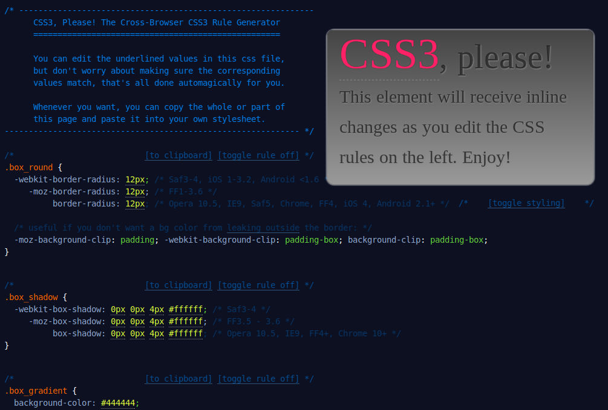
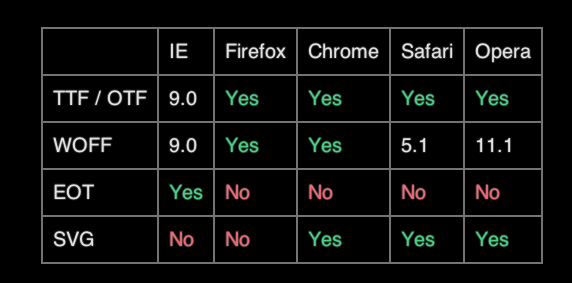

# New in CSS3
#### Dan Heberden
#### dan@bocoup.com
#### @danheberden

```notes
designed to be ran in a webkit browser
```

### Pseudo-element selectors

```css
a:hover {
        background: black;
        color: snow;
}
```

```html-run-only
<style>
a:hover {
        background: black;
        color: snow;
}
</style>
<a href="http://bocoup.com/">Bocoup.com</a>
```

```css
ul li:nth-child(3n){
 color: red;
 font-weight: bold;
}
```

```html-run-only
<style>
ul.css-selector-example li:nth-child(3n){
 color: red;
 font-weight: bold;
}
</style>
<ul class="css-selector-example">
        <li>first
        <li>second
        <li>third
        <li>fourth
        <li>fifth
        <li>sixth
        <li>seventh
        <li>eigth
        <li>ninth
</ul>
```

```css
ul li:nth-child(3n+2){
 color: red;
 font-weight: bold;
}
```

```html-run-only
<style>
ul.css-selector-example2 li:nth-child(3n+2){
 color: red;
 font-weight: bold;
}
</style>
<ul class="css-selector-example2">
        <li>first
        <li>second
        <li>third
        <li>fourth
        <li>fifth
        <li>sixth
        <li>seventh
        <li>eigth
        <li>ninth
</ul>
```

### More pseudo-element selectors

* :first-child
* :nth-child
* :link
* :visited
* :hover
* :active
* :focus
* :lang
* :first-line
* :first-letter
* :before
* :after

## CSS Specificity

```css
.special {
        color: red;
}
div {
        color: blue;
}
```

```html
<div class="special">some text</div>
```

```html-run-only
<div style="color:red">some text</div>
```

### Heirarchy (SELECTOR WARS)

* inline style 1000 points
* #id 100 points
* .class [attribute] :pseudo-class 10 points
* element :before :after 1 point

In a tie, it's the style that is defined last that wins

### Important

`!important` always wins

```css
.warning {
        color: red !important;
}
```

```html
<div class="warning" style="color: blue;">OH NO</div>
```

```html-run-only
<div style="color: red;">OH NO</div>
```

It is often a bad idea to use this, since you've just ruined any possibility to override styles

## Media Queries

Not a new concept:

```html
<link rel="stylesheet" href="screen.css" media="screen">
<link rel="stylesheet" href="print.css" media="print">
```

But now they are way coolor:

```html
<link rel="stylesheet" href="small.css"
      media="screen and (max-device-width: 480px)">
```

Any they work in stylesheets too

```css
@media (min-width: 480px) {
  img {
    width: 200px;
  }
}
```

or something more complex:

```css
@media  only screen and (-webkit-min-device-pixel-ratio: 1.5),
        only screen and (min--moz-device-pixel-ratio: 1.5),
        only screen and (-o-device-pixel-ratio: 3/2),
        only screen and (min-device-pixel-ratio: 1.5) {
  body {
        font-size:2em;
  }
}
```

## Box Model


### Border-box

setting width can work now!

```css
 -moz-box-sizing: border-box;
-webkit-box-sizing: border-box;
-ms-box-sizing: border-box;
box-sizing: border-box;
```

### CSS Frameworks

* Blueprint: http://www.blueprintcss.org/
* 960 Grid System: http://960.gs/
* YUI Grids: http://developer.yahoo.com/yui/

# CSS3

Cool things like text-shadows

```css
p {
  font-size: 2em;
  text-shadow: 3px 3px .1em rgb(255,0,255);
}
```

```html-run-only
<style>
p.css3-selector-example {
  font-size: 2em;
  text-shadow: 3px 3px .1em rgb(255,0,255);
}
</style>
<p class="css3-selector-example">I have a text shadow</p>
```

and box shadows

```css
div {
  color: black;
  background-color: lightgrey;
  box-shadow: 10px 5px 0 rgb(255,0,0);
}
```

```html-run-only
<style>
div.css3-selector-example {
        color: black;
  background-color: lightgrey;
  box-shadow: 10px 5px 0 rgb(255,0,0);
}
</style>
<div class="css3-selector-example">I have a box shadow</div>
```

and border radiuses

```css
div {
  color: black;
  background-color: rgb(0,255,255);
  padding: .2em .4em;
  border-radius: 10px;
}

div.justTheRight {
  border-radius: 5px 10px 15px 0px;
}
```

```html-run-only
<style>
div.css3-selector-example2 {
  color: black;
  background-color: rgb(0,255,255);
  padding: .2em .4em;
  border-radius: 10px;
}
div.css3-selector-example3 {
  border-radius: 5px 10px 15px 0px;
}
</style>
<div class="css3-selector-example2">I have a border radius</div>

```

```css
div {
  -webkit-box-shadow: 0px 0px 4px #ffffff; /* Safari 3-4 */
  -moz-box-shadow: 0px 0px 4px #ffffff; /* FF 3.5 - 3.6 */
  box-shadow: 0px 0px 4px #ffffff; /* Opera 10.5, IE9, FF4+, Chrome 10+ */
}

.gradient {
  background-color: #444444;
  background-image: -webkit-gradient(linear, left top, left bottom, from(#000), to(#999)); /* Saf4+, Chrome */
  background-image: -webkit-linear-gradient(top, #000, #999); /* Chrome 10+, Saf5.1+, iOS 5+ */
  background-image: -moz-linear-gradient(top, #000, #999); /* FF3.6 */
  background-image: -ms-linear-gradient(top, #000, #999); /* IE10 */
  background-image: -o-linear-gradient(top, #000, #999); /* Opera 11.10+ */
  background-image: linear-gradient(top, #000, #999);
  filter: progid:DXImageTransform.Microsoft.gradient(startColorStr='#000', EndColorStr='#999'); /* IE6-IE9 */
}
```

```html-run-only
<style>
div.css3-selector-example3{
  -webkit-box-shadow: 0px 0px 4px #ffffff; /* Safari 3-4 */
  -moz-box-shadow: 0px 0px 4px #ffffff; /* FF 3.5 - 3.6 */
  box-shadow: 0px 0px 4px #ffffff; /* Opera 10.5, IE9, FF4+, Chrome 10+ */
}

div.css3-selector-example3.gradient {
        padding: 1em;
  background-color: #444444;
  background-image: -webkit-gradient(linear, left top, left bottom, from(#000), to(#999)); /* Saf4+, Chrome */
  background-image: -webkit-linear-gradient(top, #000, #999); /* Chrome 10+, Saf5.1+, iOS 5+ */
  background-image: -moz-linear-gradient(top, #000, #999); /* FF3.6 */
  background-image: -ms-linear-gradient(top, #000, #999); /* IE10 */
  background-image: -o-linear-gradient(top, #000, #999); /* Opera 11.10+ */
  background-image: linear-gradient(top, #000, #999);
  filter: progid:DXImageTransform.Microsoft.gradient(startColorStr='#000', EndColorStr='#999'); /* IE6-IE9 */
}
</style>
<div class="css3-selector-example3 gradient">Worth It!</div>
```

### Don't memorize these

[css3please.com](http://css3please.com)



## Web Fonts

```css
@font-face {
    font-family: 'KingthingsItaliqueRegular';
    src: url('Kingthings_Italique.woff');
}

.fancy {
  font-size: 3em;
  font-family: 'KingthingsItaliqueRegular';
}
```

```html-run-only
<style>
@font-face {
    font-family: 'KingthingsItaliqueRegular';
    src: url('assets/fonts/Kingthings_Italique-webfont.woff');
}

.css3-selector-example3.fancy {
  font-size: 3em;
 font-family: 'KingthingsItaliqueRegular';
}
</style>
<div class="css3-selector-example3 fancy">Ye Olde Fonte Face</div>
```

### References

http://google.com/webfonts

http://fontsquirrel.com

### Web Fonts

#### Formats Supported



Data from: http://caniuse.com/#search=font

## Flexbox

New ways to define layout

always make the 2nd box full width

```html-run
<style>
  #flexbox1 {
	display: -webkit-box;
    -webkit-box-orient: horizontal;

    display: -moz-box;
    -moz-box-orient: horizontal;

    display: box;
    box-orient: horizontal;

	background: #555;
  }
  #flexbox1 div {
	background: white;
	text-align: center;
	font-size: 3em;
	margin: 5px;
  }
  #flexbox1 .full {
	-webkit-box-flex: 1;
	-moz-box-flex: 1;
	box-flex: 1;
  }
</style>
<div id="flexbox1">
          <div>one</div>
          <div class="full">two</div>
          <div>three</div>
</div>
```

```html-run
<style>
  #flexbox2 {

	display: -webkit-box;
          -webkit-box-orient: horizontal;
          -webkit-box-pack: center;
          -webkit-box-align: center;

                display: -moz-box;
          -moz-box-orient: horizontal;
          -moz-box-pack: center;
          -moz-box-align: center;

          display: box;
          box-orient: horizontal;
          box-pack: center;
          box-align: center;

          height: 300px;
          background: #CCC;
        }
        #flexbox2 textarea {
                width: 30%;
                height: 30%;
        }
</style>
<div id="flexbox2">
        <textarea resize></textarea>
</div>
```

## Transforms

```html-run
<style>
        .tilted {
          border: solid rgb(255,255,0);
          padding: .5em;
          font-size: 2em;
          -moz-transform: rotate(10deg);
          -moz-transform-origin: top left;
          -webkit-transform: rotate(10deg);
          -webkit-transform-origin: top left;
          -o-transform: rotate(10deg);
          -o-transform-origin: top left;
          -ms-transform: rotate(10deg);
          -ms-transform-origin: top left;
          transform: rotate(10deg);
          transform-origin: top left;
        }
</style>
<div class="tilted">I'm Tilted!</div>
```

### Transform functions

* transform: rotate(90deg);
* transform: scale(1, 2);
* transform: skew(30deg, -30deg);
* transform: translate(100px, -50px);
* transform: matrix(a, c, b, d, tx, ty);

http://en.wikipedia.org/wiki/Transformation_matrix

```html-run
<style>
.warped {
  -webkit-transform: skewY(10deg) translateX(320px) scale(6, 2);
  width: 130px;
}
</style>
<div class="warped">Whoa! Crazy!</div>
```

### Transitions

```html-run
<style>
  .transition1 {
          -webkit-transition-property: color, border-width;
          -webkit-transition-duration: .5s, .2s;
          color: blue;
          border: solid red;
          border-width: 0;
          font-size: 2em;
        }

        .transition1:hover {
          -webkit-transition-property: color, border-width;
          -webkit-transition-duration: .5s, .2s;
          border-width: 4px;
          color: white;
        }
</style>
<div class="transition1">Hover Over Me!</div>
```

### Transforms + Transitions

```html-run
<style>
        .transition2 {
          -webkit-transition-property: -webkit-transform;
          -webkit-transition-duration: .5s;
          -webkit-transform: skew(0, 0) scaleY(1);
          -webkit-transform-origin: 50% 50%;
          width: 280px;
          font-size: 2em;
        }

        .transition2:hover {
          -webkit-transition-property: -webkit-transform;
          -webkit-transition-duration: .5s;
          -webkit-transform: skew(0, 20deg) scaleY(3);
        }
</style>
<div class="transition2">Hover Over Me!</div>
```

### Keyframes

```html-run
<style>
@-webkit-keyframes colorflash {
  0% {
    color: #000; /* black */
  }
  40% {
    color: #fff; /* white */
  }
  50% {
    color: #f00; /* red */
  }
  60% {
    color: #fff; /* white */
  }
  100% {
    color: #000; /* black */
  }
}

.keyframes1 {
    font-size: 3em;
    text-shadow: 0 0 0;
    -webkit-animation: colorflash 5s infinite;
}
</style>
<div class="keyframes1">Color Flash!</div>
```

### Keyframes + Transforms

```html-run
<style>
@-webkit-keyframes spinning {
  from {
    -webkit-transform: rotate(360deg);
  }
  to {
    -webkit-transform: rotate(0);
  }
}
.spinning {
  float: left;
  -webkit-animation: spinning 3s infinite linear;
}
</style>


```


## With JavaScript

When the browser is done animating an element, it fires an
event.

For webkit, it's `webkitTransitionEnd`. Opera is `oTransitionEnd` and all
other browsers is just `transitionEnd`.

The event itself offers information like `propertyName` for what property
was animated and, of course, the actual element (`event.target`) that was
animated.


# thank you!

Dan Heberden
dan@bocoup.com
@danheberden
